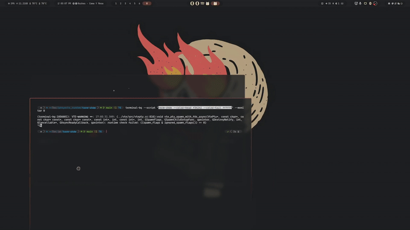

# Term-Shdw

Interactive terminal “comet” / shadow effect — a tiny Python CLI that draws a comet-like head, fading tail, aura and twinkling stars inside your terminal.
Designed to be lightweight, configurable with simple command-line flags, and shareable on unixporn as a neat terminal effect.

---

## Preview
### Term-shdw
	term-shdw --color-head f54242 --color-tail ffffff  
  

### Term-shdw and Terminal-bg
	terminal-bg --script "term-shdw --color-head f54242 --color-tail ffffff" --monitor 0
  

---

## Disclaimer

I’m a hobbyist developer who loves terminal toys. This project was created and improved with help from ChatGPT — if something is broken or behaves oddly, open an issue or submit a patch. Use at your own risk.

---

## Features

* Interactive comet head that follows mouse motion (mouse tracking).
* Fading tail with smooth color interpolation between head & tail colors.
* Light aura surrounding the head, sized to the head symbol.
* Twinkling stars that spawn randomly across the terminal.
* Command-line options for easy personalization (head/tail colors, head symbol, trail length, frame delay).
* Works on modern terminals that support mouse SGR/1006 mode; falls back to classic X10 mouse events (limited to \~223 columns).
* Small and dependency-free (pure Python).

---

## Requirements

* **Python 3.8+** (works with 3.8/3.9/3.10/3.11; if you want to support older versions change accordingly)
* A terminal emulator that supports mouse reporting. For the best experience use a terminal that supports SGR/1006 extended mouse mode (kitty, alacritty, wezterm, GNOME Terminal, etc.). If your terminal does not support extended mouse mode the program will fall back to classic X10 mouse reporting which **limits coordinates** to \~223 columns/rows (historical limitation of the protocol).

---


## Installation

The recommended way to install **term-shdw** is using `pipx`. This makes the `term-shdw` command available globally while keeping its dependencies isolated in its own virtual environment.

### Using `pipx` (Recommended)

`pipx` installs Python CLI applications into isolated environments and makes them globally available without polluting your system Python or requiring you to manually activate a virtualenv.

#### Install `pipx` (if you haven’t already)

The best way to install `pipx` on Linux is via your distribution’s package manager:

- **Ubuntu / Debian**  
  ```bash
  sudo apt update
  sudo apt install pipx
  pipx ensurepath
  sudo pipx ensurepath --global    # optional, enables `--global` flag

- **Fedora**  
  ```bash
    sudo dnf install pipx
    pipx ensurepath
    sudo pipx ensurepath --global    # optional

- **Arch Linux**  
  ```bash
    sudo pacman -S python-pipx
    pipx ensurepath
    sudo pipx ensurepath --global    # optional

- **Other distros (via pip)**  
  ```bash
    python3 -m pip install --user pipx
    python3 -m pipx ensurepath
    sudo pipx ensurepath --global    # optional

After installing, restart your shell or run source ~/.bashrc (or equivalent) so that the pipx command is on your PATH.

### Install term-shdw
- **From Github** 
    ```bash
    pipx install git+https://github.com/DaarcyDev/term-shdw.git

- **From a local clone** 
    ```bash
    git clone https://github.com/DaarcyDev/term-shdw.git
    cd term-shdw
    pipx install .


---

## Usage

If you installed via `pipx` the CLI command is:

```bash
term-shdw [OPTIONS]
```

### Command line options (current)

These flags are defined in `config.py`:

* `--color-head` — HEX color for the comet head (default: `681414`, **without `#`**).
* `--color-tail` — HEX color for the comet tail/aura (default: `7b87ed`, **without `#`**).
* `--symbol-head` — String used as the head symbol (default: `{#@#}`). The aura is automatically aligned to the symbol width.
* `--trail-length` — Maximum trail length (default: `20`).
* `--frame-delay` — Delay between frames in seconds (default: `0.0001`).

### Examples

```bash
# Run with custom head and tail colors
term-shdw --color-head ff0000 --color-tail 00ff00

# Use a different head symbol and shorter trail
term-shdw --symbol-head "(@)" --trail-length 12

# Slower frame rate (useful for debugging or slower terminals)
term-shdw --frame-delay 0.01
```

You can also run directly from the package for testing:

```bash
python -c "from term_shdw.runner import run; run()"
```

---


### Performance & frame delay

If your CPU usage is high, increase `--frame-delay` to reduce redraw rate (e.g. `--frame-delay 0.005`). On modern hardware the default is usually fine.

---

## Development & Contributing

* Project layout (recommended)

```
term-shdw
├── LICENSE
├── pyproject.toml / setup.py
├── README.md
├── term_shdw
│   ├── __init__.py
│   ├── config.py
│   ├── utils.py
│   ├── effects.py
│   ├── runner.py
│   └── main.py
└── examples/     # optional: demo scripts or gifs
```

Contributions welcome! If you want to add features (aura color, star density toggle, keyboard controls, config file support, etc.) open an issue or submit a PR.

---
